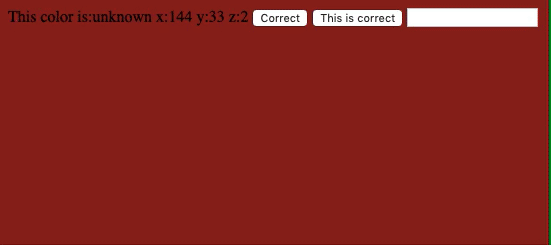
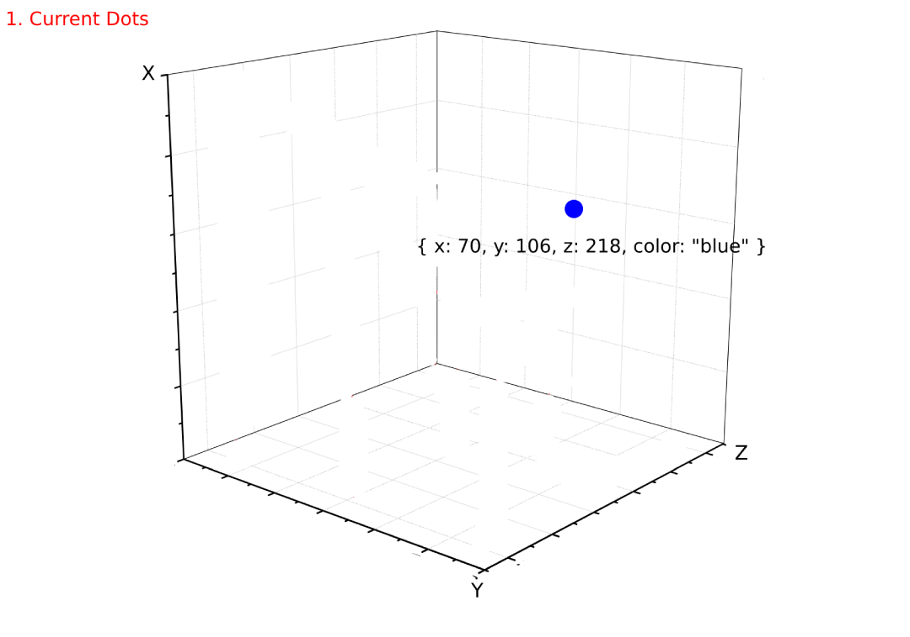

# colorPredictor.js
## Read before start
This library is created only to understand the fundamentals of AI.
Therefore it is not suitable for production.
Also don't assume that mechanism of this library is identical to AI's used in real world.
The purpose of this library is just illustrating how the real world API's work.

## Setup
After downloading this repository, open your terminal and type:
```
npm i
```
```
node index.js
```
Then open localhost:3000 in your browser.
## How does it work ?
Every time you refresh the page, you see a new color and a prediction.
To train the AI, press the "Correct" button If the prediction is correct.
If not, type the name of color to the input and press "This is correct".

After some time you see the predictions will match with the colors.



## How does the prediction work ?
Every time a random color generated, our program converts this color to x, y, z as a dot to compare this color with other colors.
```js
let randomColor = rbg(108,208,92); // green
randomColor = convert(randomColor); // { x: 108, y: 208, z: 92 }
```
Then our program loops through all the dots it currently has and find the closest dot to our randomColor dot.
Let's say we just have one dot and this dot is saved as blue.
```js
let closestDot = findClosestDot(randomColor); // { x: 70, y: 106, z: 218 } -> This is the closest dot and it is blue
```
After finding the closest dot, our program returns its color as prediction, in this case it is blue.
If the prediction is true (it is not) - The result of the prediction is provided by client (correct / this is correct) - our program sets "randomColor" as blue and adds it to the total dots.
Therefore in our next prediction, we are also going to consider the second dot.




